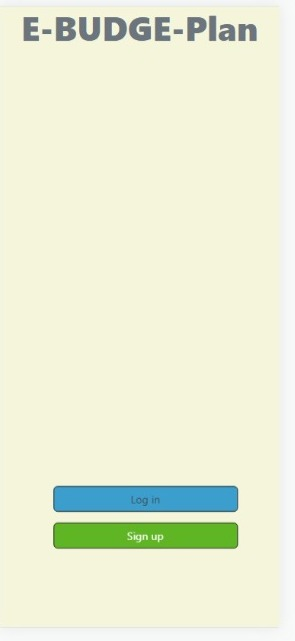
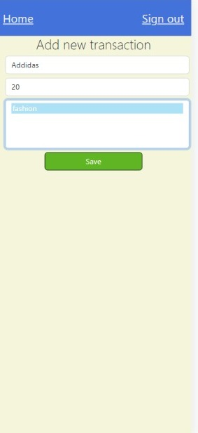
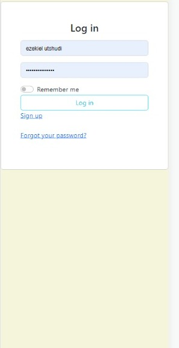
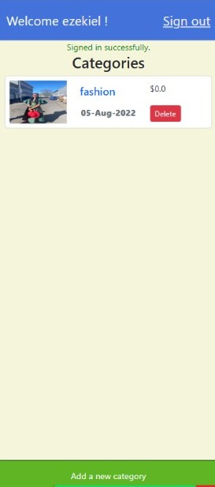
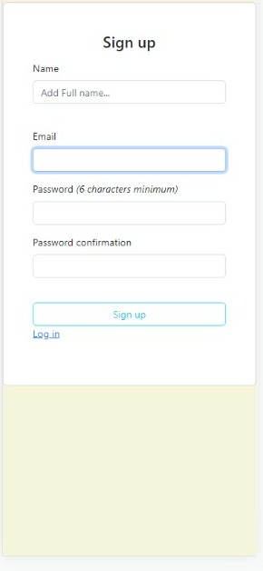

# My Budget-Plan-App

> My Budget-plan App is a mobile web application that allows you to Add your budget In categories: you will have a list of transactions associated with a category


# The App Deployment
_[Here](https://www.loom.com/share/88deefbbe5ab4d05baa203bd13147f8b)  The presentation video link_

_[Here](https://e-budget-plan.herokuapp.com/) live demo link_


  Splash Screen                                 |  Transaction Page
        |   

  Login Page                                    |  Categories Page
     |   

  Sign-Up Page                                          
 

# Getting Started


_To get a local copy up and running follow these simple steps._

1. Clone the repo
   ```sh
   git clone https://github.com/your_username_/Project-Name.git
   ```
2. Goto project directory
   ```sh
   cd recipe-app
   ```

3. Configure ` change  the Env credentials with your username and password
4. Run app
   ```sh
   rails server
   ```
   or
   ```sh
   rails s
   ```


# Testing

`bundle exec rspec` will run all the tests.

Also, you can run `bundle exec rspec spec/` to run specific tests.

You can also run `RAILS_ENV=test rspec spec/` to run the tests in test mode.

## Errors

If you encounter any errors, run the following commands.

- Run `rails db:drop db:create db:migrate` to drop, create and migrate a new database.

- Run `rubocop && rubocop -A` to check for and fix code errors.

# This project was built with

- Ruby on Rails

- PostgreSQL

- Bootstrap CSS Framework

# Author 

👤 **Sangwa Didier**

- GitHub: [Didier Sangwa](https://github.com/sangwa7)
- Twitter: [@sangwa_7](https://twitter.com/sangwa_7)
- LinkedIn: [Didier Sangwa](https://www.linkedin.com/in/didier-sangwa)


# 🤝 Contributing

Contributions, issues, and feature requests are welcome!

Feel free to check the [issues page](https://github.com/Donard97/recipe-app/issues).

# Show your support

Give a ⭐️ if you like this project!

# Acknowledgement

- Hat tip to anyone whose code was a source of inspiration.
- https://themewagon.com/themes/free-bootstrap-4-html5-cooking-website-template-tasty-recipes/
- A big thanks to [@microverseinc](https://github.com/microverseinc).

# 📝 License

This project is [MIT](./MIT.md) licensed.